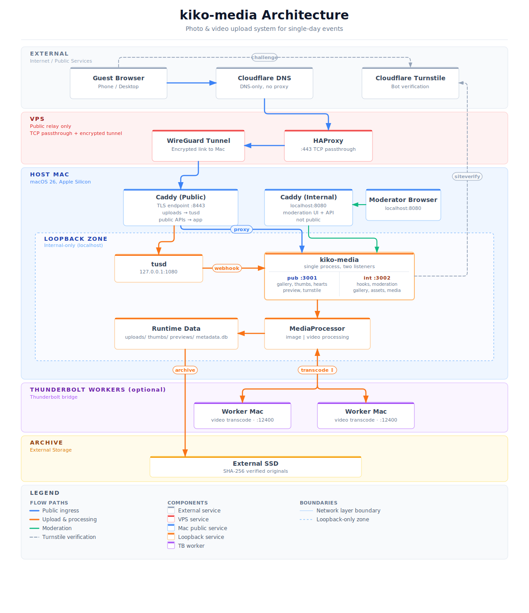

# Kiko Media

<p align="left">
  
</p>

Kiko Media is a self-hosted photo and video system for single-day events. Guests upload from their phones, media is processed on a local Mac, and the gallery updates as assets become ready.

Read the full story on my website: [Kiko Media](https://loganbarron.com/posts/2026-03-20-kiko-media)

## Core Capabilities

- Wizard-driven setup and operations (`orchestrator`)
- Benchmark-driven configuration (`benchmark`)
- Optional Thunderbolt remote workers for video transcode offload
- External SSD archive with integrity verification
- Single-page, event-focused gallery UI

## Event Flow

1. Guest opens event URL and passes Turnstile (plus optional gate secret flow).
2. Server issues a signed session cookie.
3. Uploads run through `tusd` (resumable TUS protocol).
4. `kiko-media` processes thumbnails/previews and updates gallery APIs.
5. Gallery refreshes as assets become ready.
6. Originals are archived to SSD when configured.

## Architecture Snapshot

| Area | Implementation |
|---|---|
| Backend | Swift 6.2+, Hummingbird 2.x, GRDB/SQLite |
| Media | CoreGraphics, ImageIO, AVFoundation |
| Upload Service | `tusd` |
| Edge | Caddy |
| Network | WireGuard tunnel to VPS, HAProxy passthrough, Cloudflare DNS-only |
| Runtime | Native macOS binaries managed by launchd |
| Frontend | Generated single-page `index.html`, vanilla JS, self-hosted `tus-js-client` |

<p align="center">
  
</p>

## Demo Grid

The four clips below (along with the others in the drop down) attempt to show how the system looks and works. More information here - [Kiko Media](https://loganbarron.com/posts/2026-03-20-kiko-media). 

### Happy Path

Guest entry, upload, and gallery.

https://github.com/user-attachments/assets/7bd5e70a-df42-4056-adc4-ce9823b0a56d

### Live Updates

Gallery refresh behavior as new assets become available.

https://github.com/user-attachments/assets/ffcbd396-1940-4445-88b8-a4b2c2cbd283

### Orchestrator Setup

Initial setup path through the terminal UI.

https://github.com/user-attachments/assets/c7e22821-3356-4d90-ad34-9b719e2d2d6a

### Thunderbolt Worker Status

Worker visibility and remote processing status.

https://github.com/user-attachments/assets/5558bd4b-4b35-40ca-8b34-6b80519a2634

<details>
<summary>Additional demos</summary>

### Auth Flows

Turnstile bootstrap plus optional gate-secret flow.

https://github.com/user-attachments/assets/76c7d589-99d3-409c-902b-f05b3f887877

### Upload

Resumable upload UX from the guest-facing gallery.

https://github.com/user-attachments/assets/1fb6c597-4113-4eea-932d-cb256cf4082f

### Hearts

Light social feedback without turning the event into an account system.

https://github.com/user-attachments/assets/c2518b49-220b-46cd-aeb8-2d0b765cc8d9

### Pull to Refresh

Mobile refresh behavior for the event gallery.

https://github.com/user-attachments/assets/e6cb3f1c-9b9c-4ed2-ac48-167fd732dd82

### Theme Toggle

Theme switching in the gallery UI.

https://github.com/user-attachments/assets/8264158d-7b98-4e0b-b7a3-b01c982654f8

### Orchestrator Lifecycle

Service lifecycle management from the terminal UI.

https://github.com/user-attachments/assets/8c497728-169d-43ab-972e-1b91b55a4f89

### Orchestrator Help

Built-in operator guidance inside the TUI.

https://github.com/user-attachments/assets/1be10747-c662-4307-b9ec-53436eea12ca

### Orchestrator Status

System health and current service state.

https://github.com/user-attachments/assets/fbd9d022-98ba-48d7-ad58-d32b5389fd4d

### Thunderbolt Setup

Provisioning remote Macs for distributed video work.

https://github.com/user-attachments/assets/3709ef96-bd75-4d89-9c72-8691aef5881a

### Benchmark Profile

Profile-driven tuning for machine-specific media throughput.

https://github.com/user-attachments/assets/4aeeb3c0-aa83-49ce-9c93-60230593f99f


</details>

## Docs

Use these documents for depth:

- [Runbook](docs/runbook.md): setup, deployment, operations, troubleshooting
- [Architecture](docs/architecture.md): API routes, processing flow, security boundaries
- [Advanced Config](docs/advanced-config.md): env vars, defaults, ranges, operational notes
- [Security](docs/security.md): security model, access control, attack surface, privacy
- [Benchmark Stages](docs/benchmark-stages.md): benchmark methodology and stage details
- [Complexity Aware Scheduling](docs/ca-system-guide.md): full reference guide of the CA system

## Commands

```bash
swift run -c release orchestrator
swift run -c release orchestrator --status
swift run -c release orchestrator --start
swift run -c release orchestrator --shutdown
swift run -c release orchestrator --restart
swift run -c release orchestrator --thunderbolt
swift run -c release orchestrator --tb-status

swift run -c release benchmark
swift run -c release benchmark --list
swift run -c release benchmark --stage pipeline --media-folder ~/corpus

swift test
swift test -c release

swift scripts/regen-frontend.swift
swift scripts/wipe-test-media.swift
swift scripts/generate_config_defaults.swift
```

## License

[MIT](LICENSE)